# Whisper To Input

Whisper To Input, also known by its Mandarin name 輕聲細語輸入法, is an Android keyboard that performs speech-to-text (STT/ASR) with OpenAI Whisper and input the recognized text; Supports English, Chinese, Japanese, etc. and even mixed languages and Taiwanese.

## Installation

1. Download the APK file from [the latest release](https://github.com/j3soon/whisper-to-input/releases/latest) to your phone.

2. Locate the APK file in your phone and click it. Click "Install" to install the app.

   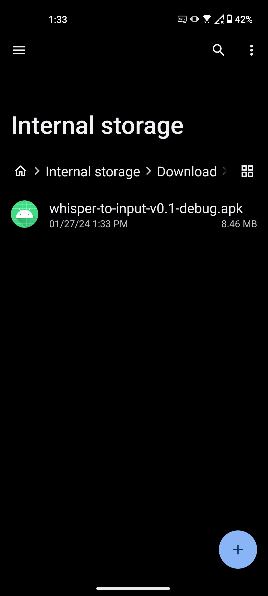
   

3. An `Unsafe app blocked` warning will pop up. Click `More details` and then click `Install anyway`. Click `Open` to open the app.

   
   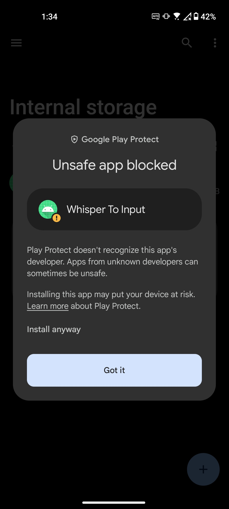
   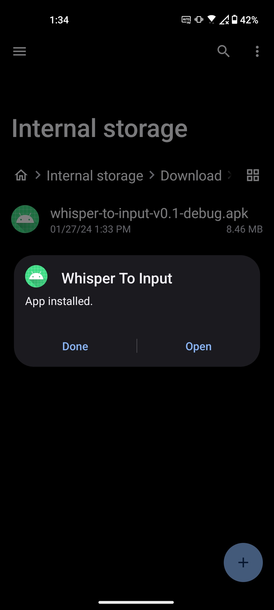

4. Allow the app to record audio and send notifications. These permissions are required for the app to work properly. If you accidentally denied the permissions, you must go to the app settings page to allow them.

   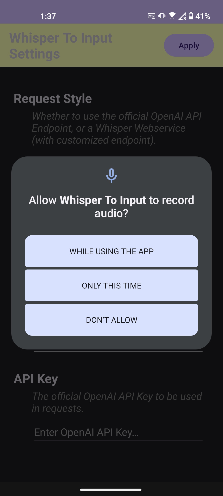
   <!-- TODO: Add send notification permission screenshot -->

5. Go to the app settings page and enter your configuration. You have 2 choices, either using the official OpenAI API with [your API key](https://platform.openai.com/api-keys) or self-host a [Whisper ASR Service](https://github.com/ahmetoner/whisper-asr-webservice) as described in [#13](https://github.com/j3soon/whisper-to-input/pull/13).

   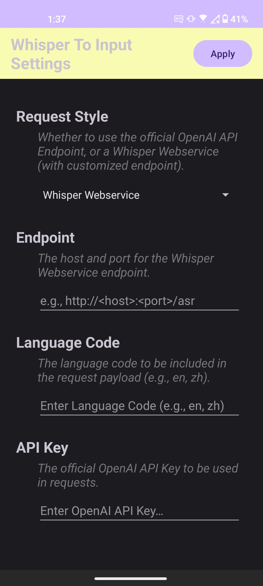

   Some example configurations:

   - OpenAI API:
     ```
     Request Style: OpenAI API
     Endpoint:      https://api.openai.com/v1/audio/transcriptions
     Language Code:
     API Key:       sk-...xxxx
     ```
   - Whisper ASR Service:
     ```
     Request Style: Whisper Webservice
     Endpoint:      http://<SERVER_IP>:9000/asr
     Language Code:
     API Key:
     ```

6. Go to the system settings page and enable the app keyboard. This process may vary depending on your Android version and phone model. The following screenshots are taken on Android 13 of a Asus Zenfone 8.

   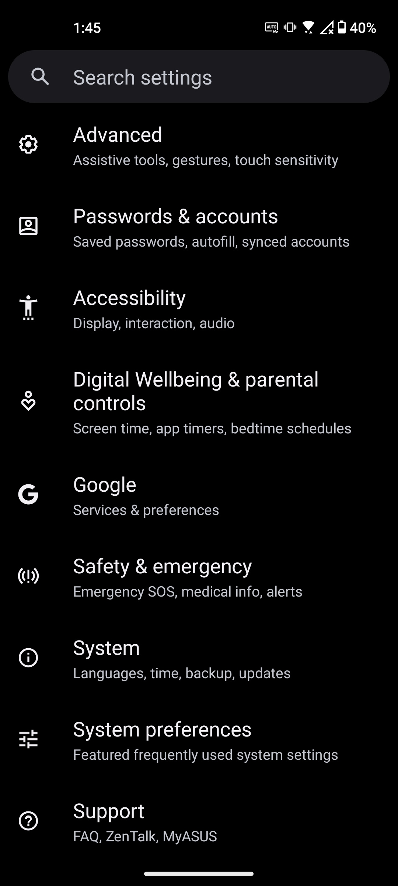
   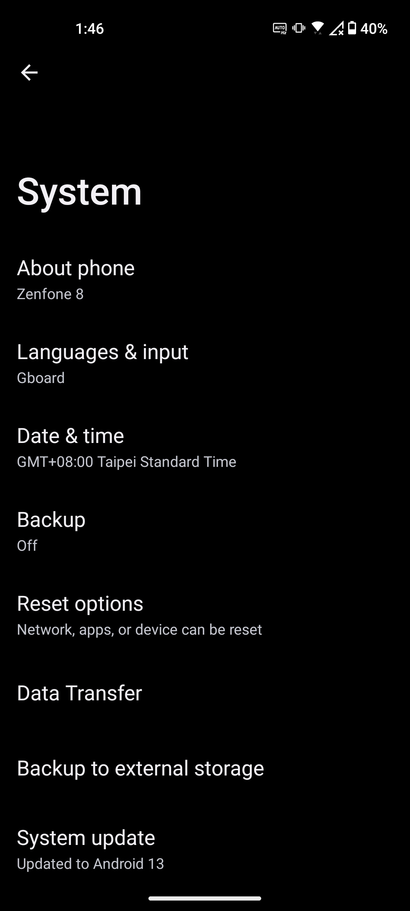
   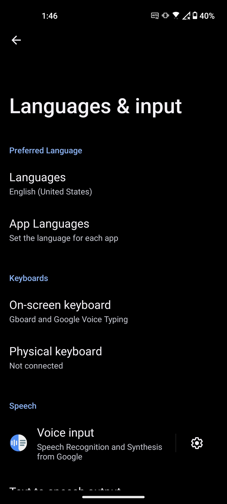
   
   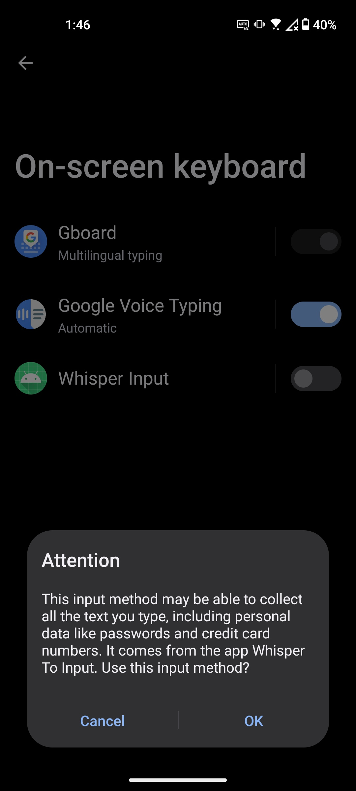
   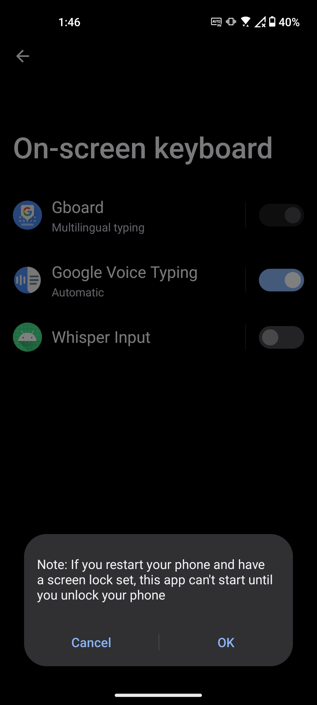
   

7. Open any app that requires text input, such as a browser, and click the input box. Choose the app keyboard by clicking the bottom right button and choosing `Whisper Input`.

   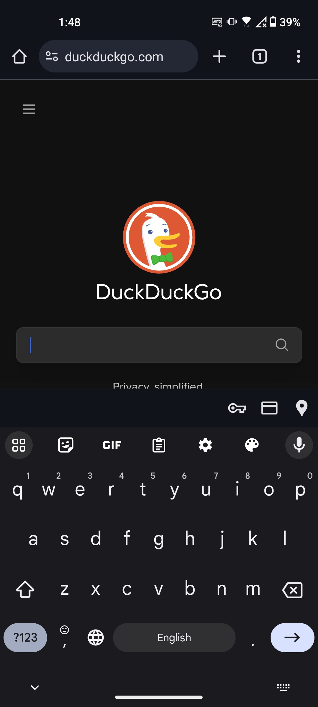
   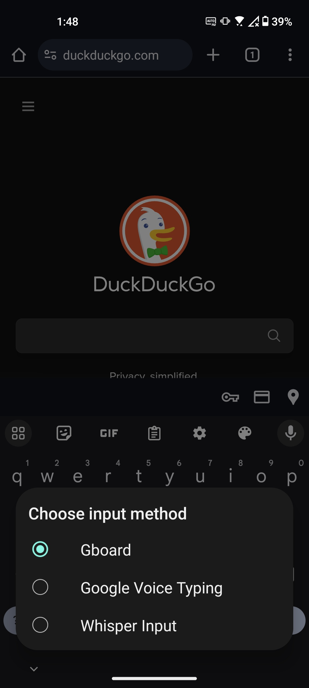
   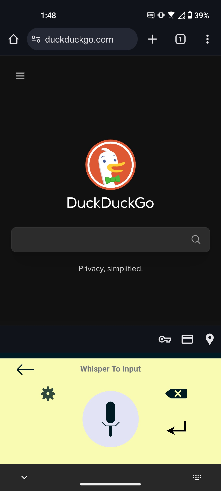

8. Click the microphone button to start recording. After you finish speaking, click the microphone button again. The recognized text will be inputted into the text box.

## Keyboard Usage

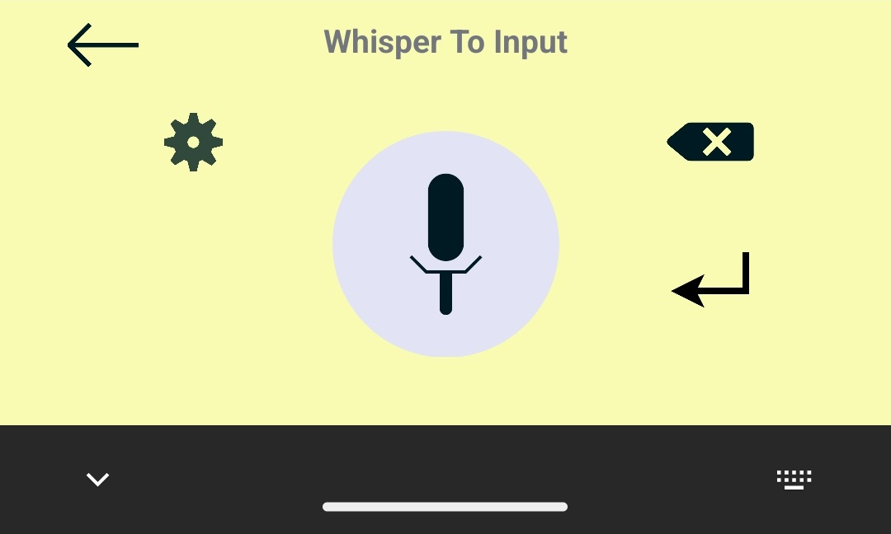

- `Microphone Key` in the center: Click to start recording, click again to stop recording, and input the recognized text.
- `Cancel Key` in the bottom left (Only visible when recording): Click to cancel the current recording.
- `Backspace Key` in the upper right: Delete the previous character. If you press and hold this key, it will keep deleting characters until you release it.
- `Enter Key` in the bottom right: Input a newline character. If you press this while recording, it will stop recording and input the recognized text with a trailing newline.
- `Settings Key` in the upper left: Open the app settings page.
- `Switch Key` in the upper left: Switch to the previous input method. Note that if there were no previous input method, this key will not do anything.

## Debugging

All current builds in the [release page](https://github.com/j3soon/whisper-to-input/releases) are debug builds. To view the logs, enable [USB debugging](https://developer.android.com/studio/debug/dev-options), connect your phone to a PC, and use `adb logcat` to view the logs. If you have a local Android Studio install, launch the [ADB tool](https://developer.android.com/tools/adb), otherwise, you may want to consider installing a minimal standalone ADB from [Minimal ADB and Fastboot](https://xdaforums.com/t/tool-minimal-adb-and-fastboot-2-9-18.2317790/).

Below are some useful `adb logcat` commands:

```sh
adb devices
adb logcat *:E
adb logcat *:W
adb logcat *:I
adb logcat *:D
adb logcat *:V
```

See [the adb doc](https://developer.android.com/tools/logcat) for more info.

## Permission Description

- `RECORD_AUDIO`: Required for the app to record audio for voice input.
- `POST_NOTIFICATIONS`: Required for the app to show toasts in the background if any error occurs.

## FAQ and Known Issues

- Sometimes the keyboard will silently fail, please see issue [#17](https://github.com/j3soon/whisper-to-input/issues/17) for further information.
- Taiwanese (or Hokkien) transcription seems to work quiet well, although [not declared officially](https://github.com/openai/whisper) (thanks [@ijsun](https://github.com/ijsun) for discovering this). To support Taiwanese transcription, do not set the `Language Code` in the settings page.

Please [open an issue](https://github.com/j3soon/whisper-to-input/issues) if you have any questions.

## Developer Notes

To build and release a newer version, open Android Studio and follow the steps below:

1. Bump the version code and version name.
2. Retrieve signing keystore and its password from [Johnson](https://github.com/j3soon).
3. Menu: `Build > Generate Signed App Bundle / APK...`
4. Select `APK`, and fill in the signing keystore path and password, and select `Debug` in the next step to build.
5. Rename the file `whisper-to-input/android/app/build/outputs/apk/debug/app-debug.apk` accordingly.
6. Create Git tag and release on GitHub.

See [the official document](https://developer.android.com/studio/publish/app-signing#sign_release) for more information.

## License

This repository is licensed under the GPLv3 license. For more information, please refer to the [LICENSE](android/LICENSE) file.

Main Contributors: Yan-Bin Diau ([@tigerpaws01](https://github.com/tigerpaws01)), Johnson Sun ([@j3soon](https://github.com/j3soon)), Ying-Chou Sun ([@ijsun](https://github.com/ijsun))

For a complete list of contributors to the code of this repository, please visit the [contributor list](https://github.com/j3soon/whisper-to-input/graphs/contributors).
